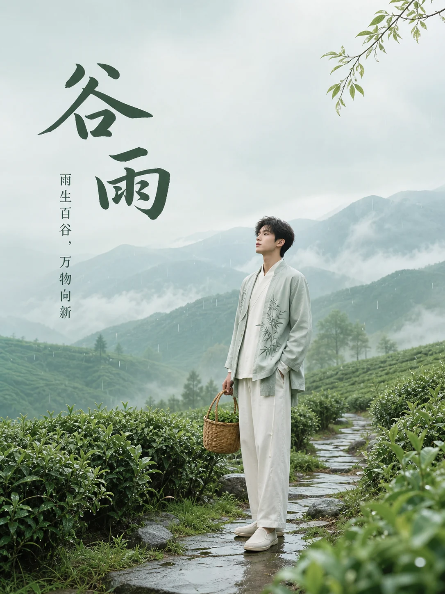

# Awesome GPT Image 中文提示词

[](https://github.com/cccyyywqq/awesome-gpt-image-prompts-zh/actions/workflows/validate.yml)
[](LICENSE)
[](data/prompts.zh-CN.json)

中文原生的 GPT Image / 多模态图像生成提示词库，收集可直接复制、改写和贡献的中文提示词。项目参考了 [EvoLinkAI/awesome-gpt-image-2-prompts](https://github.com/EvoLinkAI/awesome-gpt-image-2-prompts) 的组织方式，但提示词内容为中文原创，适合中文品牌、电商、海报、插画、社媒和产品工作流。

## 项目定位

- 用中文描述画面，不依赖英文提示词翻译。
- 每条提示词尽量包含主体、场景、构图、风格、光线、材质、文字和限制条件。
- 同时提供 Markdown 案例和 JSON 数据，方便阅读、检索和二次开发。
- 已开始收录官方生成结果图，欢迎贡献参数、模型版本和失败案例复盘。

## 适合谁

- 设计师：快速获得中文海报、电商图、社媒封面的可改写提示词。
- 内容团队：沉淀品牌常用视觉风格和活动模板。
- 开发者：基于 JSON 数据构建搜索站点、插件、CLI 或评测工具。
- 研究者：观察中文文字生成、商品视觉和本土场景的稳定性。

## 快速开始

复制任意提示词，把 `{占位符}` 替换成你的内容即可。

```text
请生成一张竖版商业海报，画幅比例 3:4。主体是 {产品名}，放置在干净的浅色展台中央；背景使用与品牌调性一致的柔和渐变和少量真实材质纹理；构图要突出产品轮廓，顶部留出标题空间，底部保留购买信息区域；光线为柔和棚拍光，边缘有细腻高光；整体风格高级、克制、真实，不要夸张变形。画面文字仅保留：{主标题}、{副标题}。
```

## 提示词结构

建议按这个顺序写：

```text
画幅与用途 -> 主体 -> 场景 -> 构图 -> 风格 -> 光线 -> 色彩 -> 材质细节 -> 文字 -> 限制条件
```

常用限制词：

```text
避免低清晰度、错误文字、畸形手指、重复元素、过度锐化、廉价塑料感、杂乱背景、明显水印、伪影、边缘破碎。
```

## 分类索引

| 分类 | 适用场景 | 案例 |
| --- | --- | --- |
| 海报与插画 | 节日海报、活动视觉、书封、公益主题 | [cases/poster-illustration.md](cases/poster-illustration.md) |
| 电商与产品广告 | 主图、详情页、品牌广告、上新物料 | [cases/ecommerce-product.md](cases/ecommerce-product.md) |
| 人像与摄影 | 职业头像、杂志大片、生活方式、写真 | [cases/portrait-photography.md](cases/portrait-photography.md) |
| 角色与 IP | 吉祥物、游戏角色、盲盒、贴纸表情 | [cases/character-ip.md](cases/character-ip.md) |
| 社媒与 UI | 封面、信息卡片、App 引导页、直播背景 | [cases/social-ui.md](cases/social-ui.md) |
| 建筑与场景 | 室内设计、展厅、城市空间、概念场景 | [cases/architecture-scene.md](cases/architecture-scene.md) |

## 实图案例

首批实图案例由 `gpt-image-2` 根据原始中文提示词生成，每个现有分类各 1 张。图片保存在 `assets/cases/`，并在 JSON 数据的 `outputs` 字段中记录模型、来源、许可和备注。

| 分类 | 结果图 | 案例 |
| --- | --- | --- |
| 海报与插画 |  | [国潮节气海报](cases/poster-illustration.md#p001-国潮节气海报) |
| 电商与产品广告 |  | [护肤品电商主图](cases/ecommerce-product.md#e001-护肤品主图) |
| 人像与摄影 |  | [职业头像](cases/portrait-photography.md#r001-职业头像) |
| 角色与 IP |  | [奶茶品牌吉祥物](cases/character-ip.md#c001-奶茶品牌吉祥物) |
| 社媒与 UI |  | [小红书封面](cases/social-ui.md#s001-小红书封面) |
| 建筑与场景 |  | [新中式书店](cases/architecture-scene.md#a001-新中式书店) |

## 精选案例

### 国潮节气海报

```text
请生成一张竖版节气海报，比例 3:4。主题是「谷雨」，画面中央是一位穿现代改良中式服装的年轻人，站在刚下过雨的茶园小径上；远处有薄雾、青山和浅色天空，近景有雨滴停留在茶叶上的细节。构图留白充足，标题「谷雨」使用端正的中文书法字形，副标题为「雨生百谷，万物向新」。整体风格为国潮插画与真实质感结合，色彩清透，避免过度饱和和廉价剪贴感。
```

### 护肤品电商主图

```text
请生成一张 1:1 电商主图。主体是一瓶半透明玻璃精华液，瓶身标签文字为「清透修护精华」，放在湿润的白色岩石台面上；周围有少量水珠、透明凝胶质感和浅绿色植物投影。背景干净，产品占画面 65%，正面朝向镜头，瓶身边缘有高级棚拍高光。整体要真实、清爽、专业，避免过多装饰、错误文字和产品形变。
```

### 职业头像

```text
请生成一张 4:5 职业头像摄影作品。人物为 30 岁左右的中文互联网产品经理，穿深灰西装外套和白色衬衫，自然微笑，看向镜头；背景是虚化的现代办公室，窗边有柔和自然光。构图为胸像，眼神清晰，肤色自然，整体气质可信、亲和、专业。不要夸张磨皮，不要杂乱背景，不要出现多余人物。
```

### 城市音乐节视觉

```text
请生成一张横版活动主视觉，比例 16:9。主题是「夏夜城市音乐节」，画面是傍晚的城市天台舞台，远处有霓虹灯和高楼轮廓，舞台灯光从蓝紫色过渡到暖橙色，观众以剪影方式呈现。画面中间留出大标题「夏夜城市音乐节」，下方放日期「2026.07.18」。整体风格年轻、热烈、有节奏感，但文字必须清楚，不要拥挤。
```

## 数据文件

结构化数据位于 [data/prompts.zh-CN.json](data/prompts.zh-CN.json)，字段规范见 [schema/prompt.schema.json](schema/prompt.schema.json)。其中 `outputs` 字段用于记录生成图或转载图的路径、模型、来源、许可、署名和备注。你可以基于它做搜索站点、CLI、浏览器插件或自动化评测。

## 本地校验

```powershell
npm run validate
npm run stats
```

校验会检查 JSON 可解析、字段完整、ID 唯一、分类有效、中文提示词存在、案例文件完整性和实图案例路径有效性。GitHub Actions 会在 push 和 pull request 时自动运行。

## 项目结构

```text
.
├── assets/                 # 生成结果图和未来兼容许可转载图
├── cases/                  # 按分类整理的 Markdown 案例
├── data/                   # 结构化提示词数据
├── docs/                   # 写作指南、质量清单和路线图
├── schema/                 # JSON 字段规范
├── scripts/                # 校验与统计脚本
└── .github/                # 工作流、Issue 模板、PR 模板
```

## 文档

- [中文图像提示词写作指南](docs/prompt-writing-guide.md)
- [提示词质量清单](docs/quality-checklist.md)
- [Roadmap](docs/roadmap.md)
- [安全说明](SECURITY.md)

## 贡献方式

欢迎提交：

- 新的中文提示词。
- 同一提示词在不同模型中的表现对比。
- 生成结果图、参数说明和模型版本。
- 失败提示词和修正过程。

贡献前请阅读 [CONTRIBUTING.md](CONTRIBUTING.md)。本项目使用 [MIT License](LICENSE) 发布。

## 致谢

项目结构参考 [EvoLinkAI/awesome-gpt-image-2-prompts](https://github.com/EvoLinkAI/awesome-gpt-image-2-prompts)。本仓库为独立中文提示词项目，不复制原仓库提示词或图片素材。
