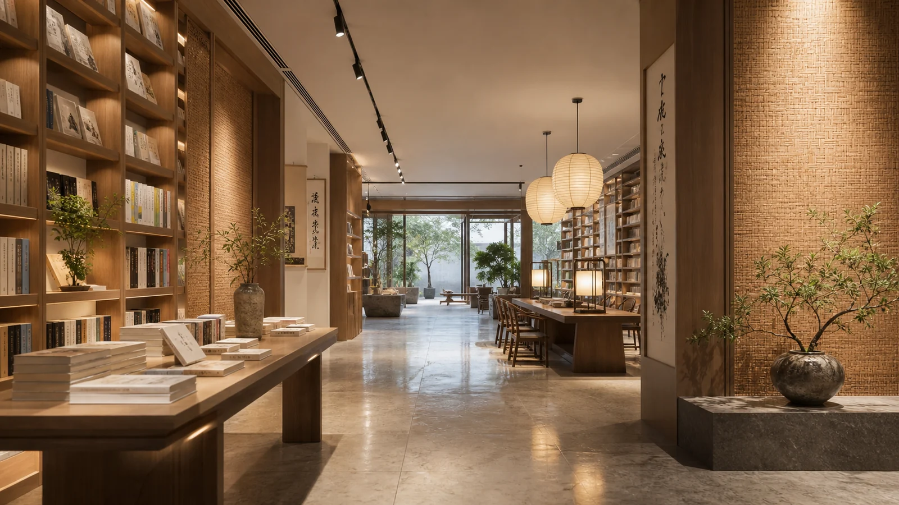
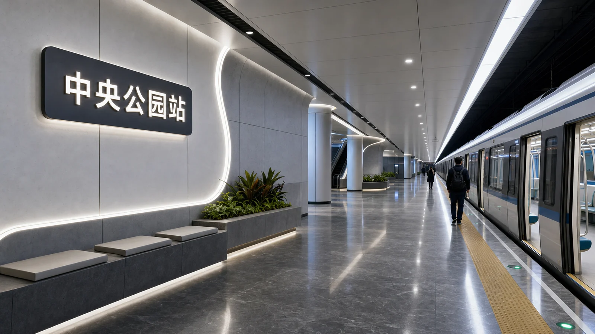
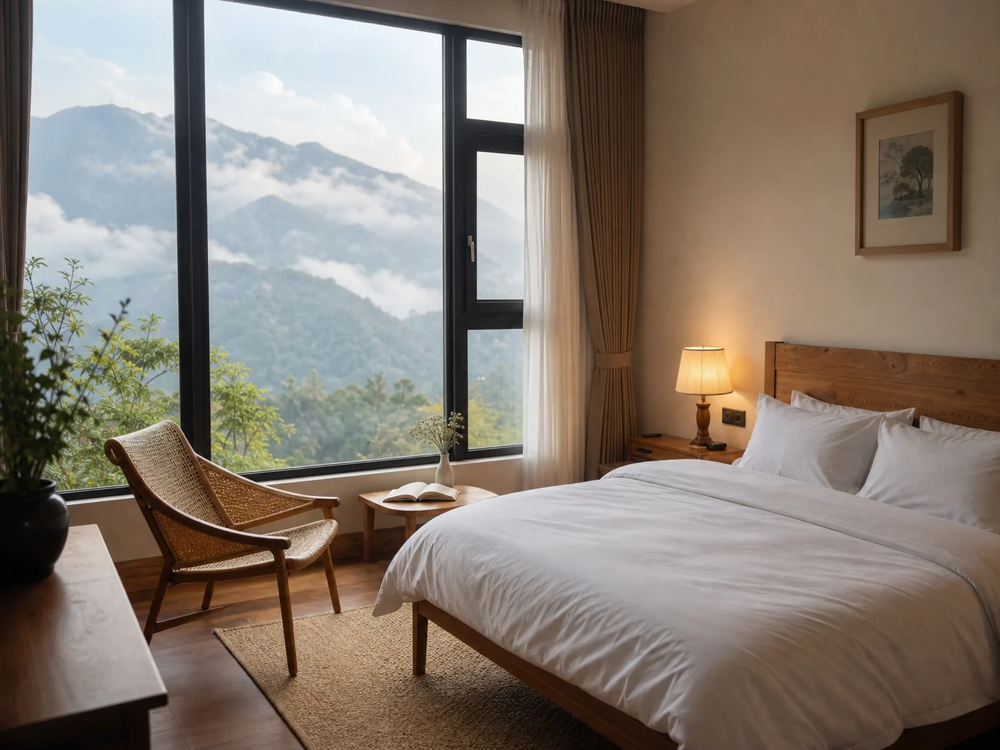
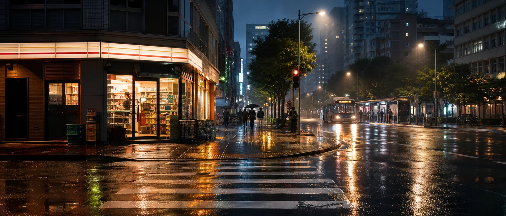
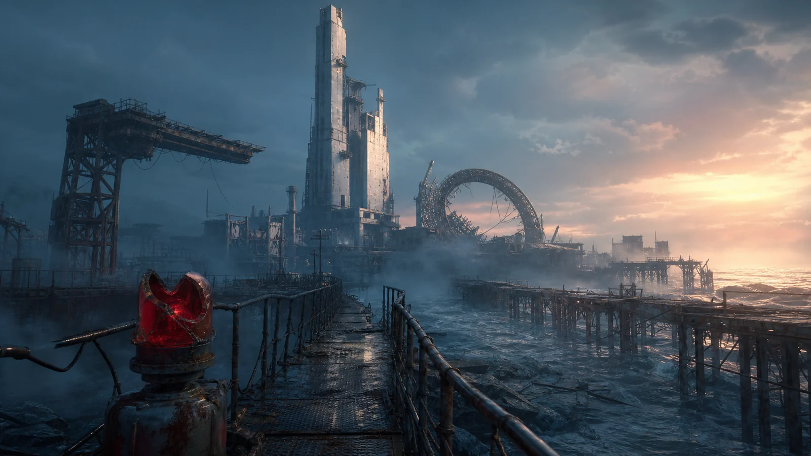
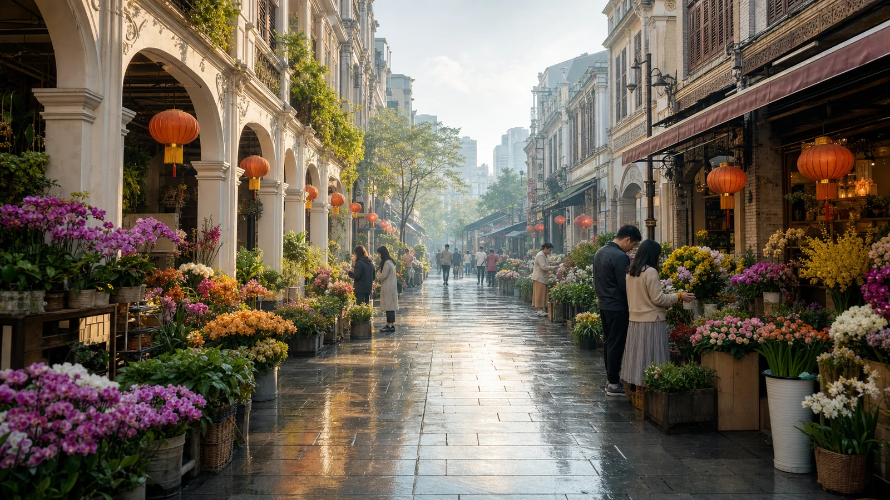
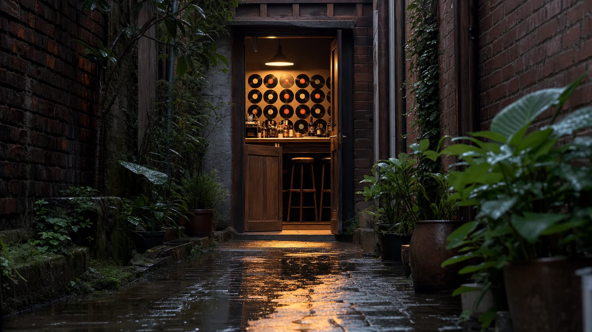
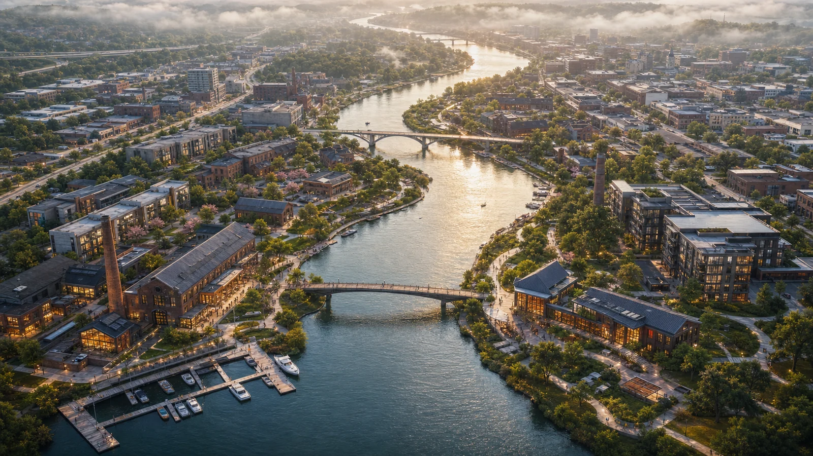

# 建筑与场景案例

适合室内设计、商业空间、展厅、城市概念、游戏场景和影视气氛图。场景提示词要写清空间功能、动线、材质、时间、镜头高度和人群密度。

## A001 新中式书店

```text
请生成一张横版室内设计效果图，比例 16:9。空间是一家新中式独立书店，入口处有木质书架、浅色石材地面、纸灯和阅读长桌；墙面局部使用竹编纹理，天花有柔和线性灯。镜头高度约 1.5 米，视角从入口看向深处，空间通透但安静。整体真实、高级、有文化气息，避免过度复古和拥挤陈列。
```

**生成结果**



- 模型：gpt-image-2
- 来源：项目官方生成图（非转载）
- 许可：MIT
- 备注：空间动线、材质和新中式氛围清晰。

## A002 未来地铁站

```text
请生成一张 16:9 未来城市地铁站概念图。站台宽敞，地面为深灰石材，墙面有柔和发光导视线，列车停靠在右侧；乘客数量少，整体秩序清晰。导视牌包含中文「中央公园站」。光线为冷白与浅蓝结合，风格真实、干净、具有公共交通设计感，避免科幻过度和文字乱码。
```

**生成结果**



- 模型：gpt-image-2
- 来源：项目官方生成图（非转载）
- 许可：MIT
- 备注：空间秩序、导视文字和未来公共交通质感清楚。


## A003 民宿房间

```text
请生成一张 4:3 民宿房间室内图。房间有大窗、白色床品、原木家具、藤编椅和浅色墙面；窗外能看到山景和清晨雾气。床边有暖色小灯，桌上放一本打开的书。整体风格自然、放松、真实，像可直接用于民宿平台的照片，避免过度广角和不合理空间。
```

**生成结果**



- 模型：gpt-image-2
- 来源：项目官方生成图（非转载）
- 许可：MIT
- 备注：房间陈设、山景窗外和平台展示图气质贴合提示词。


## A004 小型办公室

```text
请生成一张 16:9 小型创业公司办公室效果图。空间包含 12 个工位、一个玻璃会议室、一面白板墙和休息角；色彩以白色、浅木色和少量绿色植物为主。镜头从角落斜向拍摄，能看清动线和采光。整体明亮、实用、有团队感，避免豪华酒店感和过多装饰。
```

## A005 品牌展厅

```text
请生成一张 16:9 品牌展厅概念图。展厅展示智能家居产品，中央是互动体验台，墙面有嵌入式屏幕和简洁中文标题「智慧生活体验馆」；地面为浅灰微水泥，灯光均匀。空间有少量参观者，整体高级、克制、易于落地施工，避免复杂曲面和过度炫光。
```

## A006 城市雨夜街景

```text
请生成一张横版电影感场景图，比例 21:9。画面是一条雨后的城市街道，路面反射招牌灯光，远处有公交站和行人剪影；近景是湿润斑马线和路边便利店。光线为冷暖混合，空气中有轻微水汽。整体真实、有叙事感，避免过暗和过度赛博化。
```

**生成结果**



- 模型：gpt-image-2
- 来源：项目官方生成图（非转载）
- 许可：MIT
- 备注：湿润路面反光、街角店面和电影感场景明确。


## A007 开放式厨房

```text
请生成一张 4:3 家居开放式厨房效果图。空间使用白色柜门、浅木色台面和哑光黑色五金，中央有小岛台，台面摆放少量新鲜食材；背景连通餐厅，采光来自左侧大窗。整体干净、实用、温暖，适合中等户型，避免样板间过度奢华。
```

## A008 社区花店

```text
请生成一张 16:9 社区花店外立面效果图。店面位于安静街角，白色门头写「慢慢花房」，橱窗里有丰富但整齐的花束，门口摆放小木架和手写小黑板。光线是下午柔和阳光，街道干净，有生活气。整体真实、亲切、适合小店品牌视觉，避免过度童话化。
```
## A009 社区参考：废弃海上城市场景

```text
请生成一张 16:9 电影感场景概念图。画面是一座废弃海上城市，傍晚海雾中有巨大的白色混凝土塔、锈蚀钢结构平台、倾斜的环形构筑物和被海水半淹没的旧码头。前景是湿润金属栏杆和破损警示灯，中景有狭窄步道通向远处建筑，远景高塔上有零星暖色灯光。光线为冷青色海雾与远处暖橙背光结合，真实、宏大、有叙事感。
```

**生成结果**



- 模型：gpt-image-2
- 来源：项目官方生成图（非转载）
- 许可：MIT
- 参考：EvoLinkAI/awesome-gpt-image-2-API-and-Prompts（CC0-1.0），[原案例链接](https://github.com/EvoLinkAI/awesome-gpt-image-2-API-and-Prompts/blob/main/cases/character.md#case-7-mecha-girl-sea-city-key-visual)
- 备注：参考 EvoLinkAI CC0 案例的 sea-city、雾气和冷暖光场景语言，去除角色主体后改写为建筑概念图。

## A010 社区参考：岭南花市街区

```text
请生成一张 16:9 城市街区概念图。场景是清晨的岭南花市步行街，两侧是骑楼建筑和半开放花店，檐下挂着暖色灯笼，摊位上有整齐的兰花、玫瑰、菊花和绿植。地面微湿，反射晨光，少量行人正在挑选花束。镜头从街口看向深处，空间动线清楚，建筑细节真实，整体有生活气和城市更新设计感。
```

**生成结果**



- 模型：gpt-image-2
- 来源：项目官方生成图（非转载）
- 许可：MIT
- 参考：EvoLinkAI/awesome-gpt-image-2-API-and-Prompts（CC0-1.0），[原案例链接](https://github.com/EvoLinkAI/awesome-gpt-image-2-API-and-Prompts/blob/main/cases/character.md#case-11-gta-6-in-bangalore-flower-market)
- 备注：参考 EvoLinkAI CC0 案例的城市花市场景类型，去除游戏和真实地点指向后改写为岭南花市街区概念。

## A011 社区参考：窄巷黑胶酒吧场景

```text
请生成一张 16:9 商业空间场景概念图。画面是雨后窄巷尽头的一间原创黑胶酒吧，入口很小，木门半开，暖黄色灯光从室内洒到湿润石板路上。室内能看到吧台、黑胶唱片墙、少量高脚椅和一盏低垂吊灯；室外两侧是旧砖墙、绿植和反光积水。镜头从巷口低机位看向酒吧入口，空间层次清楚，氛围安静、电影感、适合小型商业改造参考。
```

**生成结果**



- 模型：gpt-image-2
- 来源：项目官方生成图（非转载）
- 许可：MIT
- 参考：EvoLinkAI/awesome-gpt-image-2-API-and-Prompts（CC0-1.0），[原案例链接](https://github.com/EvoLinkAI/awesome-gpt-image-2-API-and-Prompts/blob/main/cases/character.md#case-12-gta-6-shinjuku-bar-scene)
- 备注：参考 EvoLinkAI CC0 案例的城市酒吧地点想象场景类型，去除游戏、真实地点和真实酒吧指向后改写为原创窄巷黑胶酒吧。

## A012 社区参考：河岸城市更新鸟瞰

```text
请生成一张 16:9 城市更新概念鸟瞰图。画面是一条 S 形河道穿过原创中型城市，两岸有步行栈道、口袋公园、旧厂房改造咖啡馆、低层住宅、社区图书馆和小型码头。清晨薄雾中，河面反射柔和金色阳光，桥梁和绿道把不同街区连接起来。构图从高处斜向俯视，空间层次清晰，城市不拥挤，建筑尺度真实，整体像规划汇报中的温暖概念图。
```

**生成结果**



- 模型：gpt-image-2
- 来源：项目官方生成图（非转载）
- 许可：MIT
- 参考：EvoLinkAI/awesome-gpt-image-2-API-and-Prompts（CC0-1.0），[原案例链接](https://github.com/EvoLinkAI/awesome-gpt-image-2-API-and-Prompts/blob/main/cases/poster.md#case-1-boston-spring-2026-city-poster)
- 备注：参考 EvoLinkAI CC0 案例的河流作为城市叙事动线的构图语言，去除真实城市地标后改写为原创河岸城市更新概念场景。
