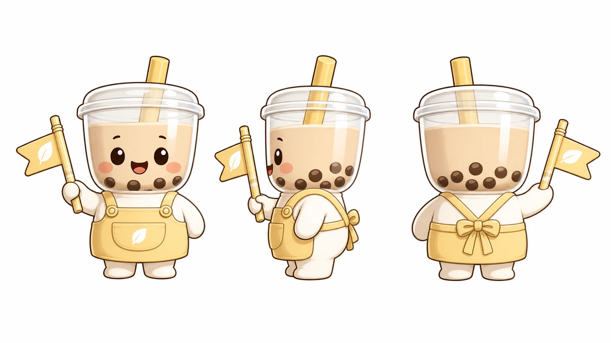
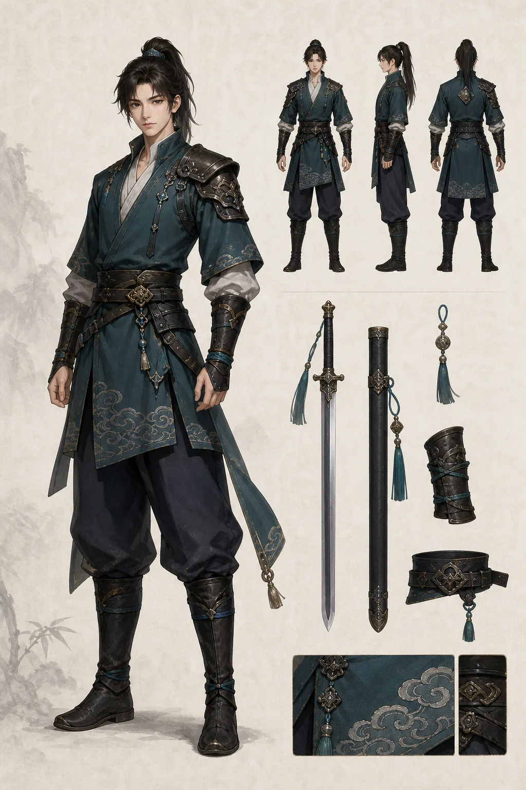
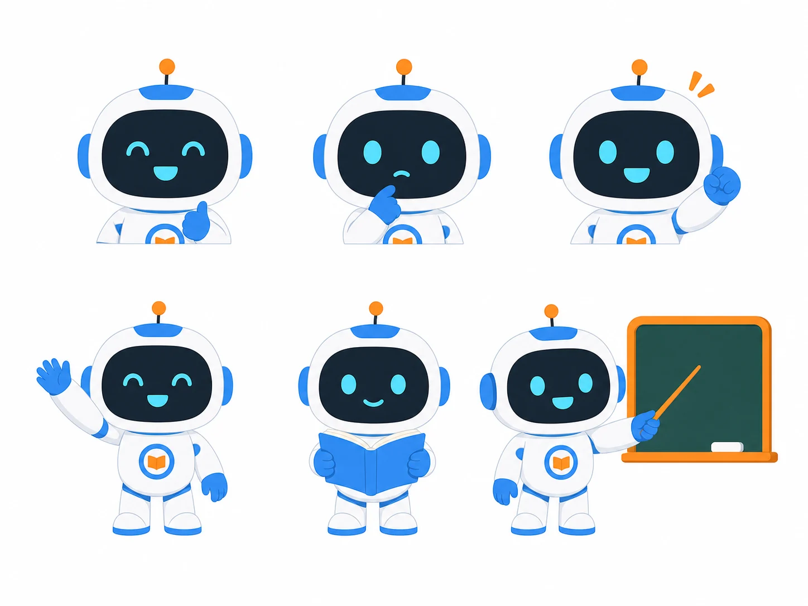
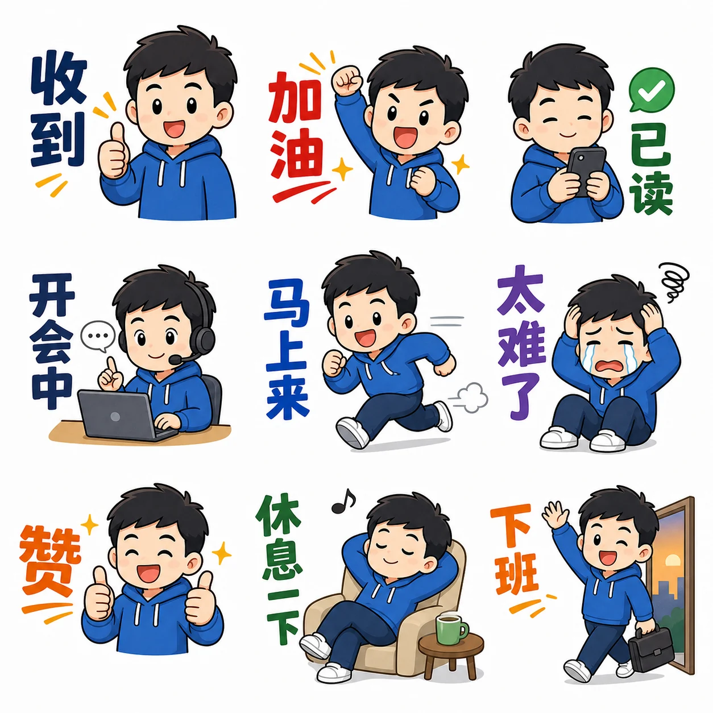
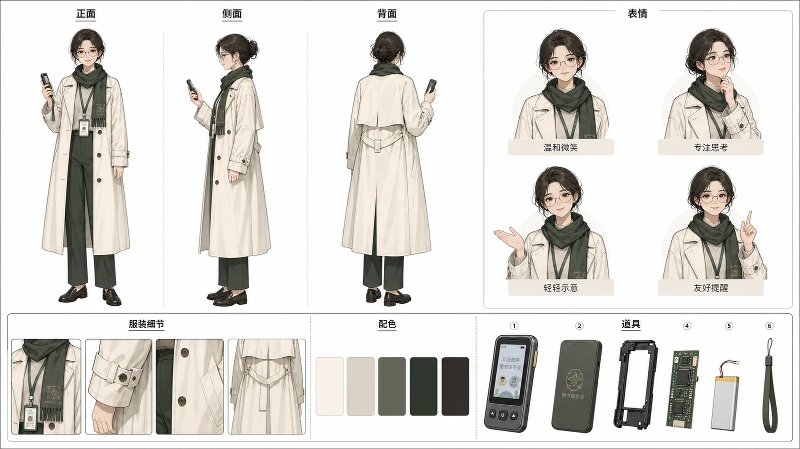
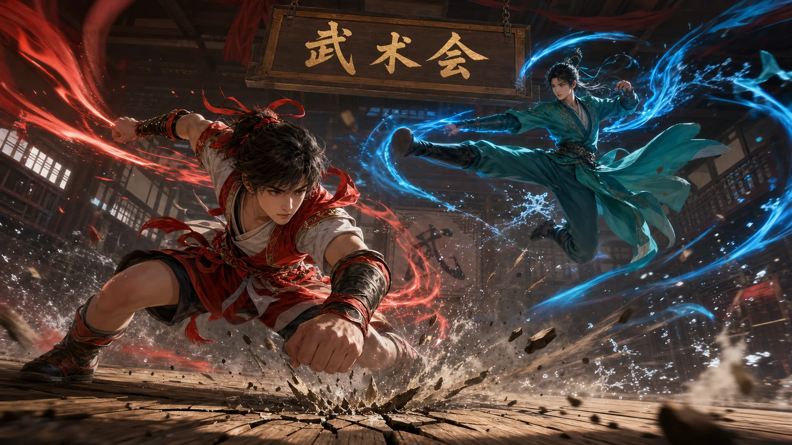

# 角色与 IP 案例

适合品牌吉祥物、游戏角色、盲盒系列、表情包和文创延展。角色提示词要写清楚比例、轮廓、服饰、表情、动作、材质和可延展性。

## C001 奶茶品牌吉祥物

```text
请生成一个奶茶品牌吉祥物的三视图，比例 16:9。角色是圆润的杯形小精灵，头部像透明奶茶杯，身体穿浅黄色围裙，表情亲切，手里拿着吸管形状的小旗。展示正面、侧面、背面三个角度，白色背景，边缘线干净，适合后续做贴纸和周边。风格可爱但不幼稚，避免复杂纹理和难以生产的细节。
```

**生成结果**



- 模型：gpt-image-2
- 来源：项目官方生成图（非转载）
- 许可：MIT
- 备注：三视图轮廓清晰，适合展示品牌 IP 延展方向。

## C002 国风侠客角色

```text
请生成一张 2:3 游戏角色设定图。角色是一位年轻国风侠客，穿深青色短打与轻量皮甲，腰间有简洁剑鞘，衣摆有云纹刺绣；站姿稳重，神情冷静。背景为浅色宣纸纹理，旁边展示武器和配饰小图。风格为现代游戏美术与传统元素结合，轮廓清晰，避免过度复杂和脸部同质化。
```

**生成结果**



- 模型：gpt-image-2
- 来源：项目官方生成图（非转载）
- 许可：MIT
- 备注：角色主体、配饰展示和设定图结构清楚。


## C003 科幻维修师

```text
请生成一张横版角色概念图，比例 16:9。角色是未来城市里的机械维修师，穿橙灰色工作外套和轻型外骨骼手臂，背包挂着工具模块；人物站在飞行器维修平台旁，背景有高层轨道和维修灯光。整体风格写实科幻，材质有金属磨损和布料褶皱，避免盔甲过厚和战斗姿态。
```

## C004 教育 App 引导角色

```text
请生成一组教育 App 引导角色，比例 4:3。角色是一个友好的学习助手机器人，圆形屏幕脸，表情有微笑、思考、鼓励三种状态；身体小巧，配色为白色、天蓝和少量橙色。白色背景，展示三个动作：打招呼、拿书、指向黑板。风格简洁、扁平、适合移动端 UI，避免过多阴影和复杂机械结构。
```

**生成结果**



- 模型：gpt-image-2
- 来源：项目官方生成图（非转载）
- 许可：MIT
- 备注：多状态机器人形象统一，适合作为 App 引导角色样板。


## C005 盲盒系列

```text
请生成一张 16:9 盲盒系列展示图。主题是「城市早餐店」，包含 6 个不同角色：豆浆、油条、包子、煎饼、粥、茶叶蛋拟人化形象；每个角色高度一致，站在浅色展示台上，表情各不相同。包装风格温暖、轻松、有本土生活气息。整体适合潮玩产品视觉，避免角色差异过大和过度细碎。
```

## C006 表情包贴纸

```text
请生成一组 3x3 中文表情包贴纸。角色是一个圆脸上班族形象，穿蓝色卫衣和白色运动鞋；九个表情分别是：收到、加油、已读、开会中、马上来、太难了、赞、休息一下、下班。白色或透明背景，线条清晰，文字简短可读。风格轻松、适合聊天软件，避免小字和复杂阴影。
```

**生成结果**



- 模型：gpt-image-2
- 来源：项目官方生成图（非转载）
- 许可：MIT
- 备注：九宫格贴纸结构完整，可用于观察短中文表情文字表现。


## C007 文创人物立牌

```text
请生成一张人物立牌设计图，比例 3:4。角色是一位年轻博物馆讲解员，穿现代改良中式制服，手持导览册，胸前有小徽章；服装配色为墨绿、米白和金色细节。背景为纯色，角色全身站姿，轮廓适合亚克力立牌切割。风格亲和、有文化感，避免衣纹过细和配件过多。
```

## C008 冒险队伍设定

```text
请生成一张横版冒险队伍角色设定图，比例 16:9。画面包含四位角色：导航员、工程师、医生、记录员，每个人有不同服装轮廓和工具；他们站在同一条地平线上，背景为浅色概念稿纸。整体风格为半写实动画设定，强调团队差异和可识别剪影，避免角色面孔重复。
```
## C009 社区参考：原创角色官方设定卡

```text
请生成一张 16:9 原创角色官方设定卡。角色是一位城市图书馆引导员，穿米白风衣、深绿色围巾，手持小型电子导览器，气质温和聪明。画面包含正面、侧面、背面三视图，右侧有 4 个表情变化，底部展示服装细节、配色板和道具拆解。白色背景，版式清楚，专业概念艺术风格，中文标签只保留「正面」「侧面」「背面」「表情」「配色」「道具」。
```

**生成结果**



- 模型：gpt-image-2
- 来源：项目官方生成图（非转载）
- 许可：MIT
- 参考：EvoLinkAI/awesome-gpt-image-2-API-and-Prompts（CC0-1.0），[原案例链接](https://github.com/EvoLinkAI/awesome-gpt-image-2-API-and-Prompts/blob/main/cases/character.md#case-2-persona5-character-reference-card)
- 备注：参考 EvoLinkAI CC0 案例的角色资料卡结构，改写为无版权角色的中文三视图设定卡。

## C010 社区参考：国风双人武术对战

```text
请生成一张 16:9 动态国风动作插画。画面中两位原创年轻武者在木质练武场中对战：前景角色穿红白短打，低身前冲，周围有红色气流和水花；背景角色穿青绿色长衫，正在空中侧踢，周围有蓝色气流。地面木板有冲击裂纹和飞散尘土，上方悬挂木牌文字「武术会」。镜头低角度，动作夸张但人体合理，整体像动画电影关键帧。
```

**生成结果**



- 模型：gpt-image-2
- 来源：项目官方生成图（非转载）
- 许可：MIT
- 参考：EvoLinkAI/awesome-gpt-image-2-API-and-Prompts（CC0-1.0），[原案例链接](https://github.com/EvoLinkAI/awesome-gpt-image-2-API-and-Prompts/blob/main/cases/character.md#case-10-anime-martial-arts-battle-illustration)
- 备注：参考 EvoLinkAI CC0 案例的双人武术对战、低角度和能量效果结构，改写为原创国风动作插画。
