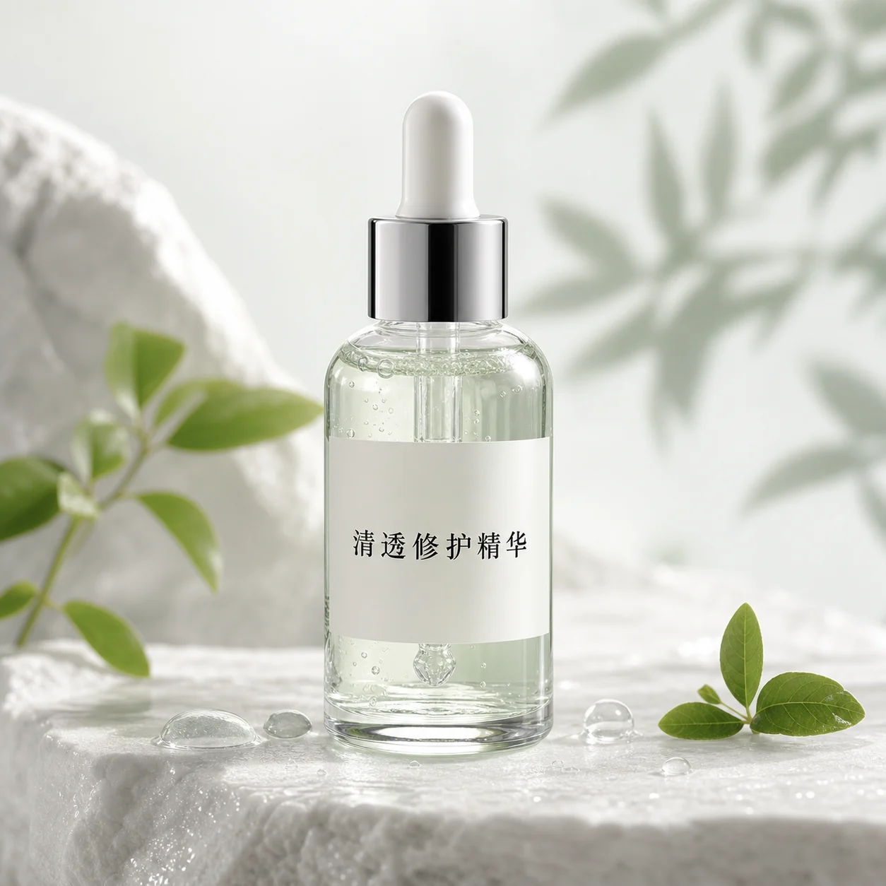
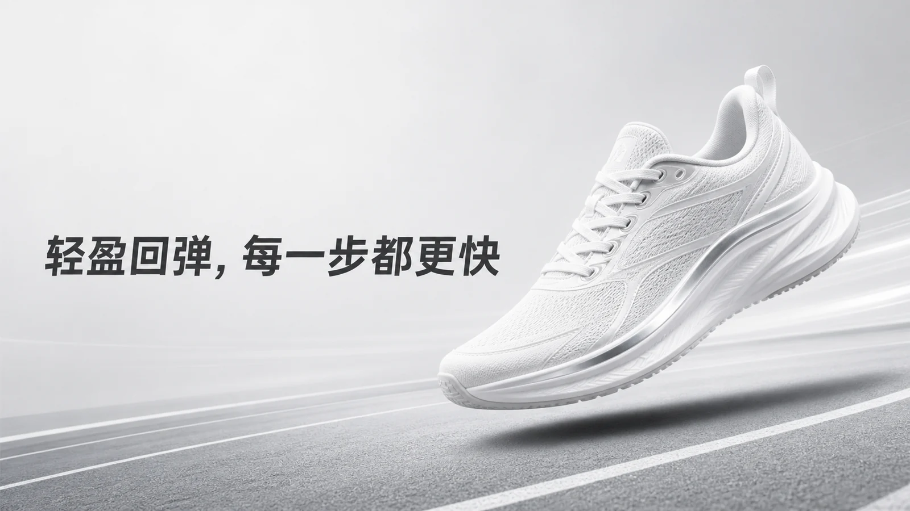
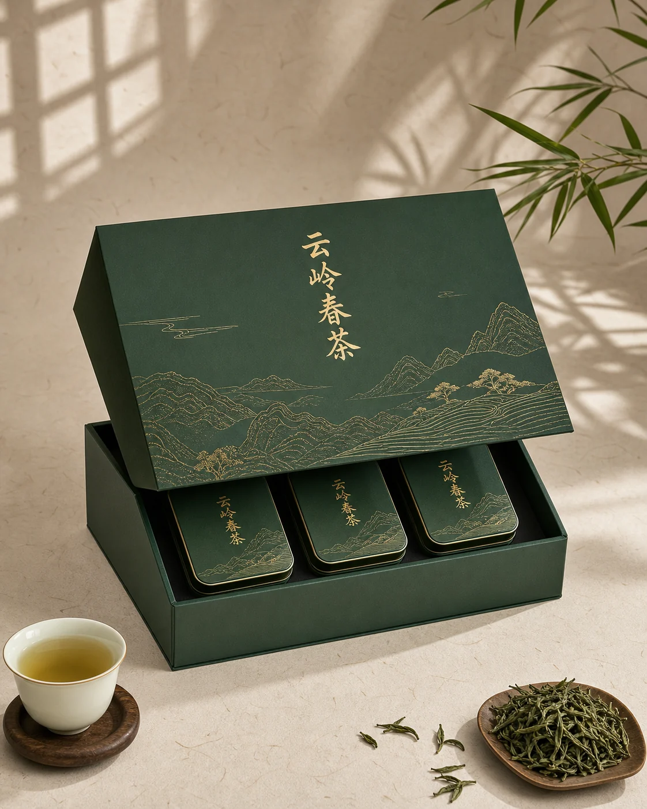
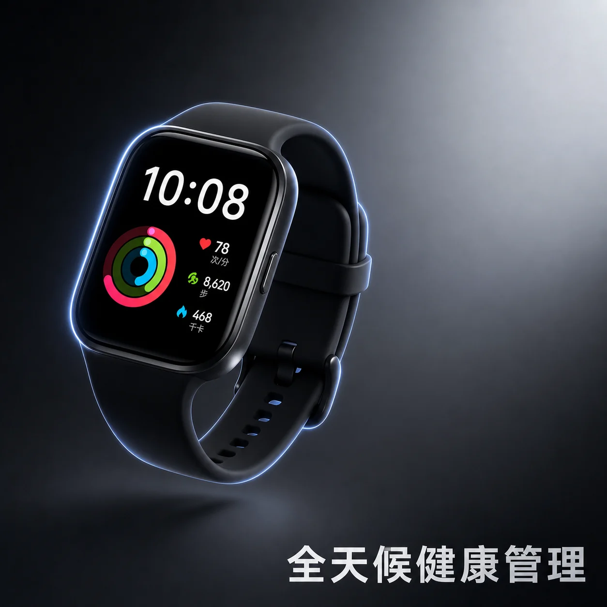

# 电商与产品广告案例

适合主图、详情页首屏、上新海报、品牌广告和社媒投放。重点是产品轮廓、材质、真实光线、文字可控和可落地的商业审美。

## E001 护肤品主图

```text
请生成一张 1:1 电商主图。主体是一瓶半透明玻璃精华液，瓶身标签文字为「清透修护精华」，放在湿润的白色岩石台面上；周围有少量水珠、透明凝胶质感和浅绿色植物投影。背景干净，产品占画面 65%，正面朝向镜头，瓶身边缘有高级棚拍高光。整体要真实、清爽、专业，避免过多装饰、错误文字和产品形变。
```

**生成结果**



- 模型：gpt-image-2
- 来源：项目官方生成图（非转载）
- 许可：MIT
- 备注：产品轮廓、玻璃材质和中文标签表现稳定。

## E002 运动鞋详情页首屏

```text
请生成一张横版产品广告图，比例 16:9。主体是一双白色跑鞋，鞋面有轻量织物纹理和银色反光细节，悬浮在浅灰色跑道上方；背景有微弱速度线和柔和阴影。左侧留出文案「轻盈回弹，每一步都更快」，右侧展示鞋子 45 度角。风格真实、科技、干净，避免夸张火焰和卡通感。
```

**生成结果**



- 模型：gpt-image-2
- 来源：项目官方生成图（非转载）
- 许可：MIT
- 备注：产品轮廓突出，速度感和留白符合详情页首屏需求。


## E003 茶叶礼盒

```text
请生成一张 4:5 国风茶叶礼盒广告图。主体是深绿色硬盒包装，盒面有金色细线山水纹样和文字「云岭春茶」；礼盒半开，露出小罐茶叶包装。背景是浅米色宣纸质感，旁边有茶杯、少量茶叶和柔和窗影。整体高级、安静、有东方审美，避免俗气金光和复杂边框。
```

**生成结果**



- 模型：gpt-image-2
- 来源：项目官方生成图（非转载）
- 许可：MIT
- 备注：包装主体、国风材质和静物氛围表现稳定。


## E004 智能手表

```text
请生成一张 1:1 科技产品广告图。主体是一块黑色智能手表，屏幕显示运动数据圆环、心率和时间，表带为哑光硅胶材质；产品悬浮在深灰到银色渐变背景前，边缘有冷色轮廓光。画面右下角留出文字「全天候健康管理」。整体精密、现代、可信，不要出现无法识别的界面乱码。
```

**生成结果**



- 模型：gpt-image-2
- 来源：项目官方生成图（非转载）
- 许可：MIT
- 备注：产品主体清晰，科技感和健康管理信息区明确。


## E005 便携咖啡机

```text
请生成一张横版生活方式广告图，比例 16:9。主体是一台便携咖啡机放在露营桌上，旁边有金属杯、咖啡豆和清晨山景；手部正在按下萃取按钮，咖啡液体形成细腻流线。光线是日出时的暖光，背景虚化，产品清晰。整体自然、真实、有户外生活感，避免过度摆拍和脏乱桌面。
```

## E006 香薰蜡烛

```text
请生成一张 4:5 香薰蜡烛广告图。主体是一只磨砂玻璃杯蜡，标签文字为「晚风木香」，摆放在深色木桌上；周围有一本打开的书、亚麻布和柔和烛光。背景为夜晚室内，暖光与冷色窗光形成对比。整体安静、舒适、精致，避免烟雾过重和文字变形。
```

## E007 露营灯

```text
请生成一张 1:1 户外产品主图。主体是一盏复古露营灯，金属外壳为雾面军绿色，灯罩发出温暖柔光；产品放在石头和木板组合的台面上，背景是虚化的夜晚营地。构图正中，产品边缘清晰，底部留出小字「轻量防水 长续航」。整体真实、结实、有质感，避免玩具感。
```

## E008 高端耳机

```text
请生成一张 16:9 高端耳机广告图。主体是一副深蓝色头戴式降噪耳机，耳罩为柔软皮革，金属转轴有细腻高光；耳机悬浮在安静的深色背景中，周围用抽象声波线条表现降噪空间。标题文字「沉浸，只听见重要的声音」放在左侧。整体奢华、克制、科技感强，避免杂乱光效和廉价塑料质感。
```
