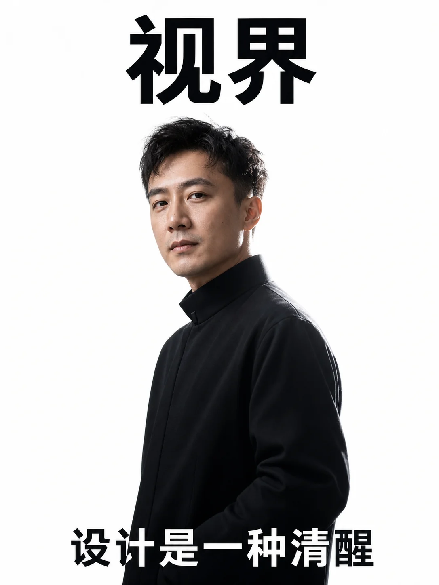
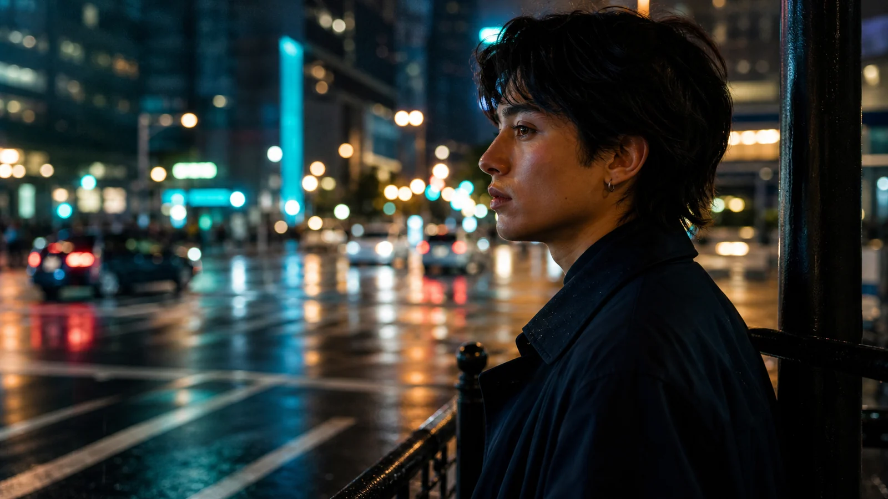
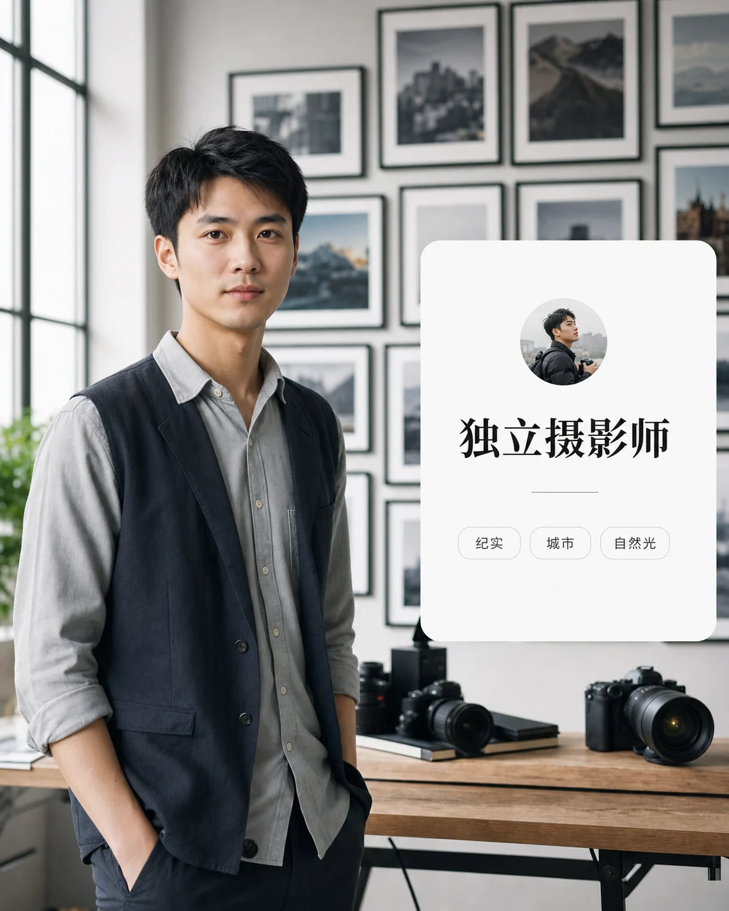
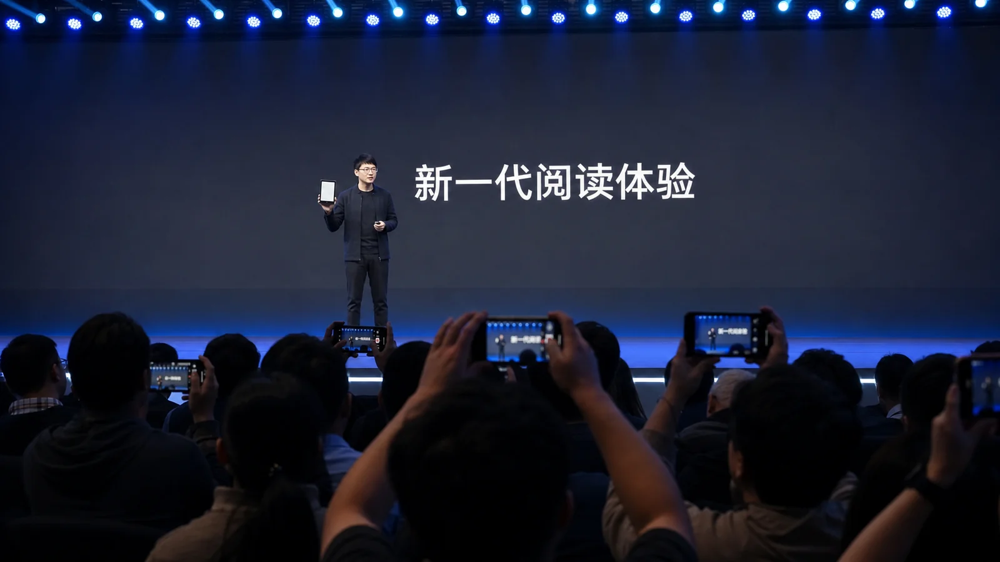

# 人像与摄影案例

适合头像、品牌人物、杂志视觉、生活方式和写真。人像提示词要明确年龄、气质、服装、姿态、光线、镜头语言和背景复杂度。

## R001 职业头像

```text
请生成一张 4:5 职业头像摄影作品。人物为 30 岁左右的中文互联网产品经理，穿深灰西装外套和白色衬衫，自然微笑，看向镜头；背景是虚化的现代办公室，窗边有柔和自然光。构图为胸像，眼神清晰，肤色自然，整体气质可信、亲和、专业。不要夸张磨皮，不要杂乱背景，不要出现多余人物。
```

**生成结果**


- 模型：gpt-image-2
- 来源：项目官方生成图（非转载）
- 许可：MIT
- 备注：头像构图、自然光和职业气质贴合提示词。

## R002 杂志封面人像

```text
请生成一张竖版杂志封面人像，比例 3:4。人物是一位 35 岁左右的中文独立设计师，穿黑色立领外套，站在极简白色摄影棚中；姿态放松但有力量，视线略偏向镜头。光线为大面积柔光加一束侧逆光，突出面部轮廓和服装质感。顶部留出刊名「视界」，底部留出封面标题「设计是一种清醒」。整体高级、克制、真实。
```

**生成结果**



- 模型：gpt-image-2
- 来源：项目官方生成图（非转载）
- 许可：MIT
- 备注：人物姿态、棚拍质感和封面层级贴合提示词。


## R003 古风写真

```text
请生成一张 2:3 古风人像写真。人物穿浅青色宋制长衫，站在有竹影的庭院廊下，手中拿着一卷书；背景有白墙、木窗和柔和晨光。构图为半身，衣料纹理清楚，发型简洁自然。整体风格淡雅、清透、具有东方审美，避免影楼夸张妆容和过度磨皮。
```

## R004 夜景街头人像

```text
请生成一张横版街头人像摄影，比例 16:9。人物穿深色风衣，站在雨后城市街角，身后有虚化的霓虹招牌和车灯反光；人物侧脸被冷色霓虹和暖色路灯共同照亮。镜头为 50mm，背景虚化自然，画面有电影感。避免脸部变形、过暗和低清晰度。
```

**生成结果**



- 模型：gpt-image-2
- 来源：项目官方生成图（非转载）
- 许可：MIT
- 备注：雨夜反光、霓虹光线和电影感人像氛围明确。


## R005 生活方式照片

```text
请生成一张 4:5 生活方式摄影。人物坐在明亮厨房的木桌旁，正在写早晨计划，旁边有咖啡杯、笔记本电脑和简单早餐；窗外光线柔和，室内干净但不刻意摆拍。整体氛围自律、温暖、真实，人物表情自然。避免广告硬照感和过度滤镜。
```

**生成结果**


- 模型：gpt-image-2
- 来源：项目官方生成图（非转载）
- 许可：MIT
- 备注：厨房自然光和早晨计划场景贴合生活方式样板。


## R006 运动员肖像

```text
请生成一张 3:4 运动员肖像照。人物穿深色训练服，站在室内训练场边，脸上有轻微汗水，眼神专注；背景有虚化的训练器材和冷色顶灯。构图为半身，肌肉线条自然，肤色真实，整体具有力量感和纪录片摄影质感。避免夸张肌肉和过度锐化。
```

## R007 音乐人宣传照

```text
请生成一张 16:9 音乐人宣传照。人物坐在小型录音室里，旁边有键盘、监听音箱和柔和灯带；人物穿简洁黑色衬衫，手扶耳机，看向镜头。画面左侧留出中文文字「新专辑 即将上线」。整体风格温暖、专业、有创作氛围，避免杂乱线缆和错误文字。
```

## R008 婚礼纪实感人像

```text
请生成一张 4:5 婚礼纪实摄影。人物穿简洁白色婚纱，站在窗边整理头纱，阳光透过白纱形成柔和高光；背景是干净的准备间，有花束和浅色墙面。构图自然，表情放松，细节真实。整体浪漫、安静、不浮夸，避免塑料皮肤和过度曝光。
```
## R009 社区参考：创作者介绍页人像

```text
请生成一张 4:5 创作者介绍页人像视觉。人物是一位 28 岁左右的中文独立摄影师，穿浅灰衬衫和深色马甲，站在明亮工作室中，身后有相机、照片墙和柔和窗光。画面右侧保留资料卡区域，包含头像旁的简短标题「独立摄影师」，三条信息标签「纪实」「城市」「自然光」。整体像高质量个人网站 About 页面主视觉，真实、干净、有专业气质。
```

**生成结果**



- 模型：gpt-image-2
- 来源：项目官方生成图（非转载）
- 许可：MIT
- 参考：EvoLinkAI/awesome-gpt-image-2-API-and-Prompts（CC0-1.0），[原案例链接](https://github.com/EvoLinkAI/awesome-gpt-image-2-API-and-Prompts/blob/main/cases/character.md#case-3-gal-game-character-introduction-page)
- 备注：参考 EvoLinkAI CC0 案例的角色介绍页信息层级，改写为真实中文创作者 About 页面人像。

## R010 社区参考：发布会观众席抓拍

```text
请生成一张 16:9 活动纪实摄影。画面像观众席中用手机拍下的新品发布会现场，远处舞台上是一位中文科技创业者正在介绍一款电子阅读器新品，身后大屏只有清晰标题「新一代阅读体验」。前景有几排观众的肩膀和手机剪影，画面略有真实抓拍感但不模糊，灯光为发布会蓝白舞台光。不要出现真实品牌、真实名人或真实公司标识。
```

**生成结果**



- 模型：gpt-image-2
- 来源：项目官方生成图（非转载）
- 许可：MIT
- 参考：EvoLinkAI/awesome-gpt-image-2-API-and-Prompts（CC0-1.0），[原案例链接](https://github.com/EvoLinkAI/awesome-gpt-image-2-API-and-Prompts/blob/main/cases/ui.md#case-2-amateur-iphone-keynote-snapshot)
- 备注：参考 EvoLinkAI CC0 案例的观众席手机抓拍构图，改写为无真实品牌和无真实名人的中文科技发布会纪实照。
