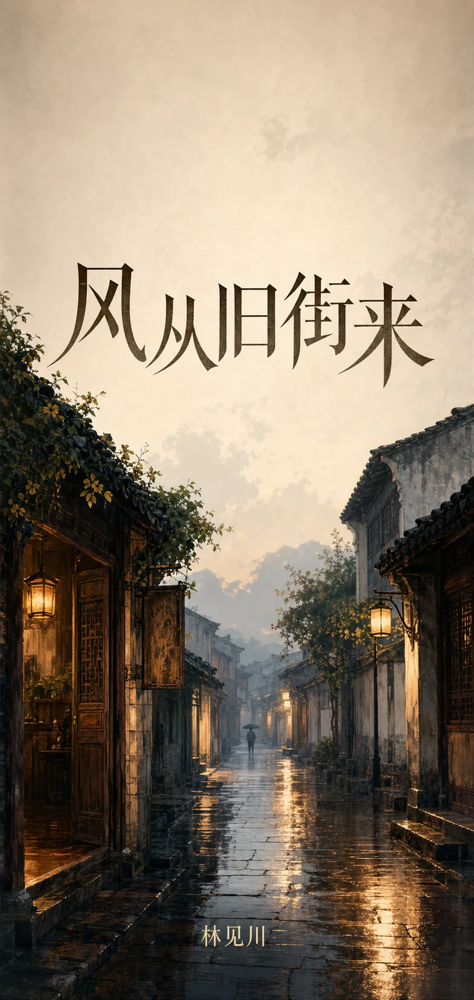
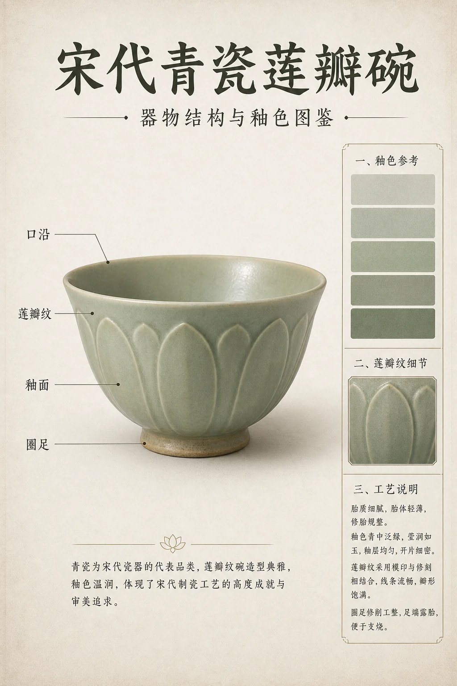
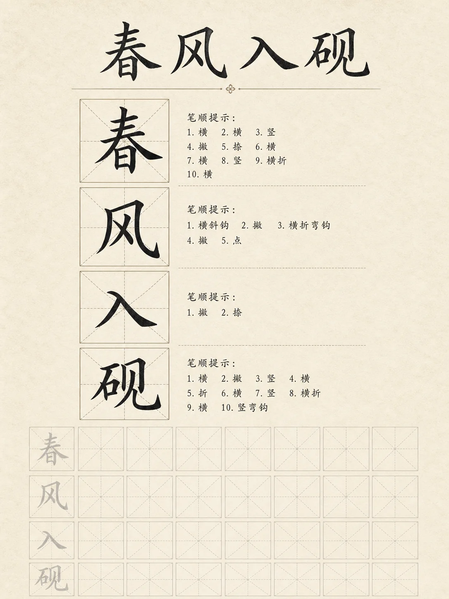
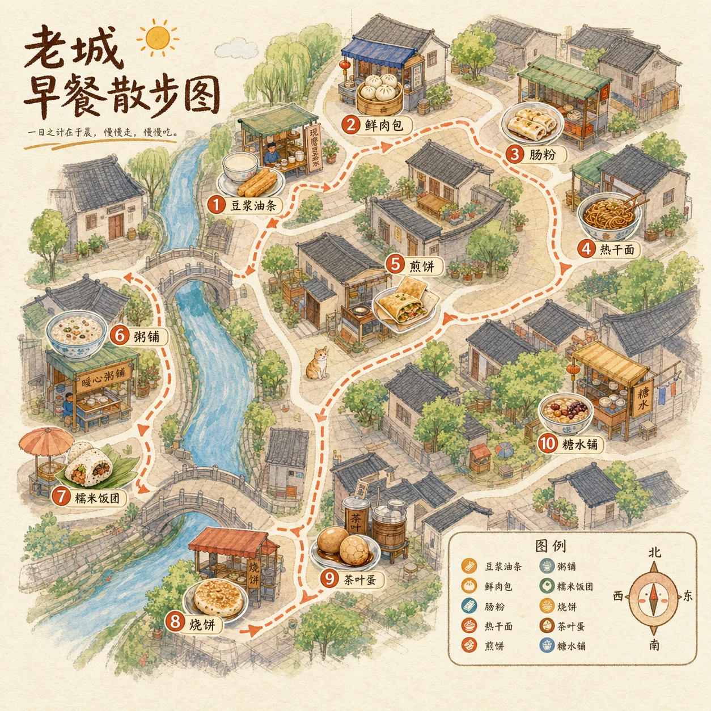

# 海报与插画案例

适合节日营销、活动主视觉、公益传播、书封和信息图。中文提示词建议明确文字内容、留白位置和画幅比例，减少模型生成乱码或排版拥挤。

## P001 国潮节气海报

```text
请生成一张竖版节气海报，比例 3:4。主题是「谷雨」，画面中央是一位穿现代改良中式服装的年轻人，站在刚下过雨的茶园小径上；远处有薄雾、青山和浅色天空，近景有雨滴停留在茶叶上的细节。构图留白充足，标题「谷雨」使用端正的中文书法字形，副标题为「雨生百谷，万物向新」。整体风格为国潮插画与真实质感结合，色彩清透，避免过度饱和和廉价剪贴感。
```

**生成结果**


- 模型：gpt-image-2
- 来源：项目官方生成图（非转载）
- 许可：MIT
- 备注：中文标题和副标题可读，适合作为节气海报样板。

## P002 城市音乐节主视觉

```text
请生成一张横版活动主视觉，比例 16:9。主题是「夏夜城市音乐节」，画面是傍晚的城市天台舞台，远处有霓虹灯和高楼轮廓，舞台灯光从蓝紫色过渡到暖橙色，观众以剪影方式呈现。画面中间留出大标题「夏夜城市音乐节」，下方放日期「2026.07.18」。整体风格年轻、热烈、有节奏感，但文字必须清楚，不要拥挤。
```

**生成结果**


- 模型：gpt-image-2
- 来源：项目官方生成图（非转载）
- 许可：MIT
- 备注：文字清晰，舞台灯光和城市天台氛围贴合提示词。


## P003 公益环保海报

```text
请生成一张竖版公益海报，比例 4:5。画面主体是一只透明玻璃瓶中生长出的微型城市花园，瓶外是干净的白色背景和柔和阴影；瓶内有道路、屋顶绿植、雨水回收装置和阳光。顶部文字为「让城市重新呼吸」，底部小字为「低碳生活，从今天开始」。风格为超现实摄影与精细插画结合，清洁、可信、具有公共传播感，避免恐吓式画面和杂乱元素。
```

## P004 新书封面插画

```text
请生成一张中文小说封面，比例 2:3。书名为「风从旧街来」，画面是一条雨后的老街，青石路面反射暖色灯光，远处有一个撑伞的人影，近处是微微打开的木门和旧招牌。标题放在上方三分之一处，字体优雅、清晰，作者名「林见川」放在底部。整体氛围温柔、悬念感轻微，像文学小说封面，不要恐怖风，不要过度装饰。
```

**生成结果**



- 模型：gpt-image-2
- 来源：项目官方生成图（非转载）
- 许可：MIT
- 备注：竖版书封氛围明确，适合作为文学封面类样板。


## P005 儿童绘本跨页

```text
请生成一张儿童绘本跨页插画，比例 16:9。画面是一个小朋友在夜晚的房间里搭建纸板飞船，窗外有明亮星空，房间里散落着彩笔、剪刀、胶带和手绘星球。构图左侧是小朋友专注的侧影，右侧是纸板飞船和从窗户洒进来的月光。风格温暖、童真、细节丰富，色彩柔和，避免写实恐怖感和成人化表情。
```

## P006 咖啡馆开业海报

```text
请生成一张竖版咖啡馆开业海报，比例 3:4。画面主体是一杯拿铁放在木质吧台上，杯面有细腻拉花；背景是清晨阳光照进小店，能看到简洁的吧台、磨豆机和少量绿植。顶部文字「山谷咖啡开业」，副标题「4 月 20 日至 4 月 27 日 全场第二杯半价」。整体风格真实、温暖、清爽，文字排版像精品咖啡品牌，不要花哨促销风。
```

## P007 运动赛事海报

```text
请生成一张竖版运动赛事海报，比例 4:5。主题是「城市夜跑挑战赛」，画面中央是一位跑者从湿润的城市道路上冲出，背景有动态光轨和远处建筑灯光；鞋底溅起少量水花。标题放在上方：「城市夜跑挑战赛」，底部放信息：「2026.06.12 19:30」。风格要有速度感、真实摄影质感和干净排版，避免人物肢体变形和文字错误。
```

## P008 信息图海报

```text
请生成一张竖版中文信息图海报，比例 9:16。主题是「一杯奶茶的糖分」，整体采用清晰的信息分区：顶部大标题，中间用三组透明杯子展示少糖、正常糖、全糖的对比，底部是简洁建议。颜色使用奶白、浅棕、薄荷绿，图标线条统一，中文文字清晰可读。避免复杂背景、过多小字和错误数字。
```

**生成结果**


- 模型：gpt-image-2
- 来源：项目官方生成图（非转载）
- 许可：MIT
- 备注：信息分区清楚，可用于观察中文信息图文字稳定性。
## P009 社区参考：文博器物图鉴海报

```text
用途：文博专题图鉴海报。请生成一张 3:4 竖版中文信息图，主题是「宋代青瓷莲瓣碗」。中央是一只写实质感的青瓷碗，釉色温润，边缘有莲瓣纹细节；左侧用引线标注「口沿」「莲瓣纹」「釉面」「圈足」，右侧展示釉色样本、纹样放大图和工艺说明。顶部标题为「宋代青瓷莲瓣碗」，副标题为「器物结构与釉色图鉴」。背景为米白宣纸质感，整体像博物馆展板，信息清楚、克制、可收藏。
```

**生成结果**



- 模型：gpt-image-2
- 来源：项目官方生成图（非转载）
- 许可：MIT
- 参考：EvoLinkAI/awesome-gpt-image-2-API-and-Prompts（CC0-1.0），[原案例链接](https://github.com/EvoLinkAI/awesome-gpt-image-2-API-and-Prompts/blob/main/cases/ui.md#case-25-museum-style-hanfu-breakdown-infographic)
- 备注：参考 EvoLinkAI CC0 案例的“博物馆图鉴式中文拆解信息图”结构，改写为青瓷器物图鉴。

## P010 社区参考：中文书法临摹字帖

```text
请生成一张 3:4 中文书法临摹字帖海报。主题文字为「春风入砚」，采用楷书练习页版式：顶部是标题「春风入砚」，中间展示 4 个大号范字，每个字放在米字格中，旁边有简短笔画提示；下方有 2 行浅灰描红练习格。纸张为米白宣纸质感，墨色清润，整体像可打印的高质量书法字帖，安静、规整、可读。
```

**生成结果**



- 模型：gpt-image-2
- 来源：项目官方生成图（非转载）
- 许可：MIT
- 参考：EvoLinkAI/awesome-gpt-image-2-API-and-Prompts（CC0-1.0），[原案例链接](https://github.com/EvoLinkAI/awesome-gpt-image-2-API-and-Prompts/blob/main/cases/ui.md#case-33-calligraphy-copybook-sheet)
- 备注：参考 EvoLinkAI CC0 案例的书法临摹字帖任务形式，改写为中文楷书练习页；主标题和大字可读，小号笔画说明仍需人工复核。

## P011 社区参考：城市早餐手绘地图

```text
请生成一张 1:1 手绘风格城市早餐地图，主题是「老城早餐散步图」。画面以鸟瞰视角呈现一片原创老城区街巷，地图不追求真实比例，但道路、河道、小桥和街角摊位要清楚。地图上分布 10 个早餐小插画：豆浆油条、鲜肉包、肠粉、热干面、煎饼、粥铺、糯米饭团、烧饼、茶叶蛋、糖水铺，每个点旁有短中文标签。左上角标题「老城早餐散步图」，右下角有图例和指南针。风格为水彩和彩铅混合，温暖、可爱、信息清楚。
```

**生成结果**



- 模型：gpt-image-2
- 来源：项目官方生成图（非转载）
- 许可：MIT
- 参考：EvoLinkAI/awesome-gpt-image-2-API-and-Prompts（CC0-1.0），[原案例链接](https://github.com/EvoLinkAI/awesome-gpt-image-2-API-and-Prompts/blob/main/cases/poster.md#case-3-chengdu-food-map-illustration)
- 备注：参考 EvoLinkAI CC0 案例的城市美食地图鸟瞰手绘结构，改写为不指向真实城市和真实店名的原创早餐散步地图。
