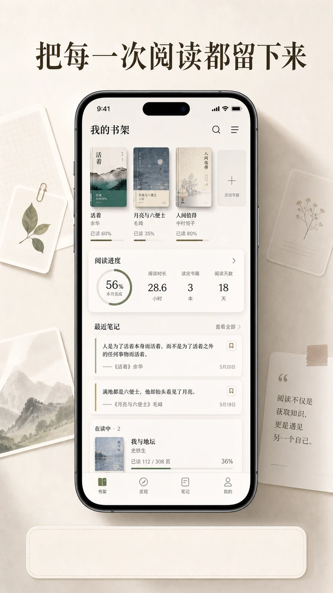
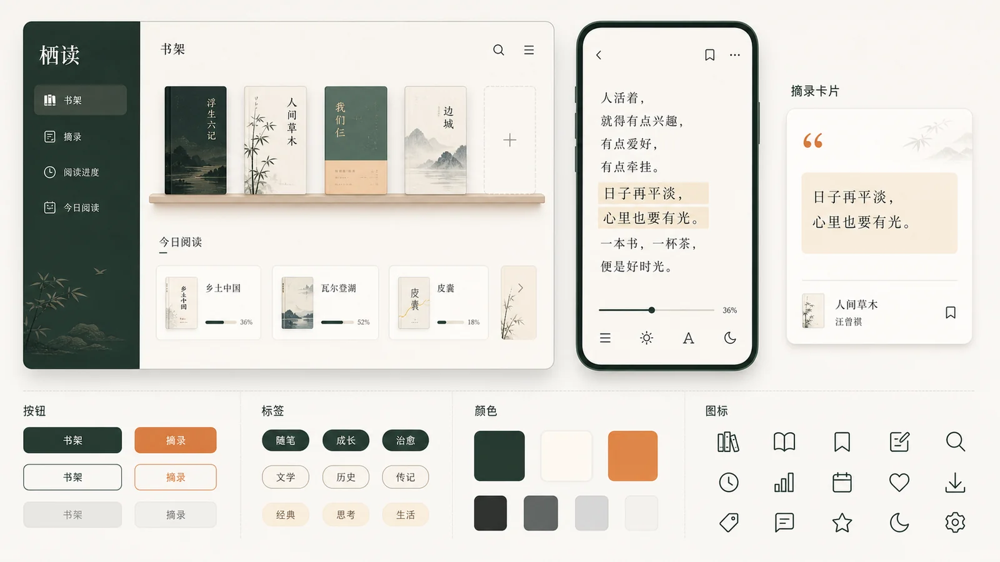
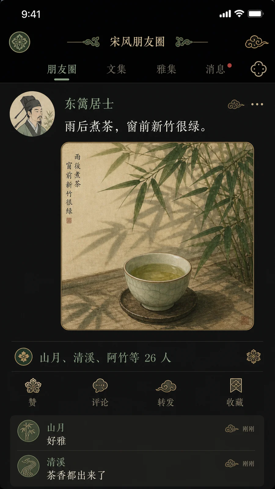
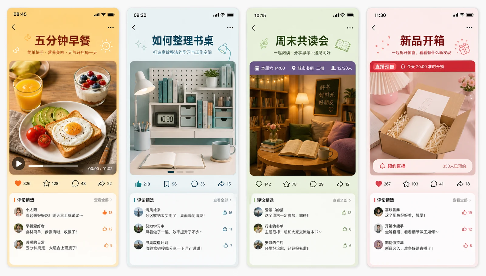
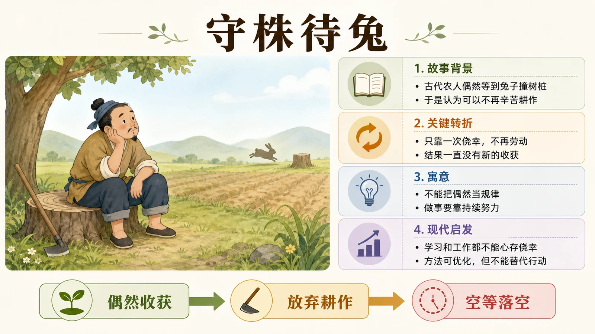

# 社媒与 UI 案例

适合小红书封面、公众号头图、知识卡片、App 引导页、直播背景和 PPT 封面。重点是信息层级、留白、可读文字和平台比例。

## S001 小红书封面

```text
请生成一张小红书封面图，比例 3:4。主题是「3 个方法整理电子书库」，背景是整洁的书桌，上面有平板、电子阅读器、笔记本和一杯咖啡；画面中央放大标题「整理电子书库」，下方小标题「3 个方法」。风格清爽、有知识感，字体粗细对比明显，避免过多小字和杂乱装饰。
```

**生成结果**


- 模型：gpt-image-2
- 来源：项目官方生成图（非转载）
- 许可：MIT
- 备注：标题和副标题可读，符合知识型封面样板。

## S002 知识卡片

```text
请生成一张 1:1 知识卡片。主题是「番茄工作法」，版面分为三块：25 分钟专注、5 分钟休息、4 轮后长休息；每块配简洁线性图标。主色为白色和清新的红色点缀，整体像高质量中文效率工具卡片。文字必须清晰，不要出现英文乱码，不要背景过花。
```

**生成结果**


- 模型：gpt-image-2
- 来源：项目官方生成图（非转载）
- 许可：MIT
- 备注：信息卡片结构清楚，图标和标题层级明确。


## S003 App 引导页

```text
请生成一张移动 App 引导页视觉，比例 9:16。产品是个人阅读管理 App，画面中央是一部手机界面，界面展示书架、阅读进度和摘录卡片；背景有柔和纸张纹理和漂浮的简洁卡片。顶部文案「把每一次阅读都留下来」，底部保留按钮区域但不要写按钮文字。风格现代、安静、可信，适合中文工具产品。
```

**生成结果**



- 模型：gpt-image-2
- 来源：项目官方生成图（非转载）
- 许可：MIT
- 备注：手机界面、纸张质感和引导页氛围符合提示词。


## S004 公众号头图

```text
请生成一张公众号文章头图，比例 2.35:1。主题是「AI 工具如何改变内容团队」，画面是一个整洁的编辑工作台，屏幕上有文档、素材库和流程节点，背景为现代办公室。标题放在左侧，中文清晰可读；右侧是带层次的工作流可视化。整体专业、理性、有科技感，避免夸张机器人元素。
```

## S005 直播间背景

```text
请生成一张横版直播间背景，比例 16:9。主题是「新品发布直播」，背景为简洁的品牌展示墙，中间有产品展示台，两侧有柔和灯带和少量植物。主标题区域写「新品发布」，下方预留价格和卖点区域。整体干净、明亮、电商专业，避免信息过满和廉价促销风。
```

**生成结果**


- 模型：gpt-image-2
- 来源：项目官方生成图（非转载）
- 许可：MIT
- 备注：直播间舞台、标题区和卖点预留区清晰。


## S006 PPT 封面

```text
请生成一张 16:9 商业汇报 PPT 封面。主题是「2026 用户增长策略」，背景为抽象但真实的城市数据网络，线条与节点低调融合在深色照片质感中。标题居中偏左，副标题「产品增长部」和日期放在下方。整体稳重、现代、适合企业会议，避免花哨渐变和复杂 3D 字。
```

## S007 图标套组

```text
请生成一套 12 个中文阅读 App 功能图标，比例 1:1，白色背景。图标包括：书架、搜索、摘录、笔记、标签、统计、同步、导入、导出、夜间模式、朗读、设置。风格为统一线性图标，圆角一致，线宽一致，使用深灰和少量蓝色。不要文字，不要复杂渐变，不要拟物风格。
```

## S008 社群活动海报

```text
请生成一张竖版社群活动海报，比例 9:16。主题是「周末共读会」，画面是几个人围坐在明亮的社区空间里阅读和讨论，桌上有书、便签和温暖灯光。标题「周末共读会」放在顶部，时间「每周六 15:00」放在底部。风格亲切、真实、有参与感，避免像商业广告。
```
## S009 社区参考：阅读工具 UI 设计系统

```text
请生成一张 16:9 中文阅读工具 UI 设计系统展示图。画面包含网页首页、移动端阅读页、摘录卡片、按钮、标签、颜色系统和图标组，整体布局像设计系统总览板。产品主题是「栖读」，风格安静、现代、留白充足，主色为墨绿、米白和少量橙色。界面文字只保留「栖读」「书架」「摘录」「阅读进度」「今日阅读」。不要做营销落地页，要像真实产品设计稿。
```

**生成结果**



- 模型：gpt-image-2
- 来源：项目官方生成图（非转载）
- 许可：MIT
- 参考：EvoLinkAI/awesome-gpt-image-2-API-and-Prompts（CC0-1.0），[原案例链接](https://github.com/EvoLinkAI/awesome-gpt-image-2-API-and-Prompts/blob/main/cases/ui.md#case-1-one-prompt-ui-design-generation)
- 备注：参考 EvoLinkAI CC0 案例的“一句话 UI 设计系统”任务形式，改写为中文阅读工具设计系统。

## S010 社区参考：宋风社交动态界面

```text
请生成一张 9:16 手机社交动态界面 mockup，主题是「宋风朋友圈」。界面采用深色模式和宋代雅致配色，头像是原创宋代文人画像，用户名为「东篱居士」，发布内容为「雨后煮茶，窗前新竹很绿。」配图是一张工笔画风茶盏和竹影。点赞区写「山月、清溪、阿竹等 26 人」，评论区有两条短评：「好雅」「茶香都出来了」。界面图标用宋代纹样替代，但整体仍像现代社交 App 截图。
```

**生成结果**



- 模型：gpt-image-2
- 来源：项目官方生成图（非转载）
- 许可：MIT
- 参考：EvoLinkAI/awesome-gpt-image-2-API-and-Prompts（CC0-1.0），[原案例链接](https://github.com/EvoLinkAI/awesome-gpt-image-2-API-and-Prompts/blob/main/cases/ui.md#case-4-song-dynasty-social-media-feed)
- 备注：参考 EvoLinkAI CC0 案例的“宋朝社交媒体界面”古今融合构思，改写为原创用户和原创内容；整体界面成立，部分小号中文需人工复核。

## S011 社区参考：多平台内容截图矩阵

```text
请生成一张 16:9 多平台内容截图矩阵 mockup，画面中并排展示 4 张原创手机内容截图，不使用任何真实平台 logo。四张截图主题分别是：社区菜谱短视频「五分钟早餐」、知识卡片「如何整理书桌」、活动预告「周末共读会」、直播预告「新品开箱」。每张截图都有独立顶部状态栏、标题区、主图、互动图标和评论预览，界面风格统一但配色有区分。整体像内容运营汇报中的素材预览页，中文标题清楚，信息不要过密。
```

**生成结果**



- 模型：gpt-image-2
- 来源：项目官方生成图（非转载）
- 许可：MIT
- 参考：EvoLinkAI/awesome-gpt-image-2-API-and-Prompts（CC0-1.0），[原案例链接](https://github.com/EvoLinkAI/awesome-gpt-image-2-API-and-Prompts/blob/main/cases/ui.md#case-5-multi-platform-content-screenshots)
- 备注：参考 EvoLinkAI CC0 案例的多平台内容截图并列展示形式，改写为无真实平台标识的原创内容运营 mockup；小号评论文字需人工复核。

## S012 社区参考：成语故事解释幻灯片

```text
请生成一张 16:9 中文知识科普幻灯片，主题是「守株待兔」。画面融合温和儿童插画和高密度讲解幻灯片：左侧是简洁插画，一个农夫坐在树桩旁等待，远处有田地和兔子剪影；右侧是结构化信息区，包含「故事背景」「关键转折」「寓意」「现代启发」四个模块，每个模块用短中文要点呈现。顶部标题「守株待兔」，底部有一条简洁流程箭头：偶然收获 → 放弃耕作 → 空等落空。整体清楚、有教育感，不要花哨。
```

**生成结果**



- 模型：gpt-image-2
- 来源：项目官方生成图（非转载）
- 许可：MIT
- 参考：EvoLinkAI/awesome-gpt-image-2-API-and-Prompts（CC0-1.0），[原案例链接](https://github.com/EvoLinkAI/awesome-gpt-image-2-API-and-Prompts/blob/main/cases/ui.md#case-10-momotaro-explainer-slide)
- 备注：参考 EvoLinkAI CC0 案例的故事解释幻灯片和高信息密度讲解结构，改写为中文成语故事科普页；正文小号中文需人工复核。
